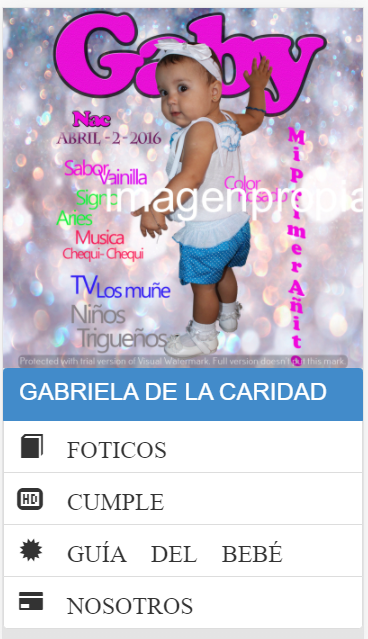

# README

Un ejemplo de app en ionic para fotógrafos

### Como ver el proyecto?

- Descarga de github el proyecto
- Levanta un servidor web y apunta a la raiz y listo

### Puedes usarlo?

- Cambia los textos y referencias a las imagenes y ya tienes una app de ionic responsive

